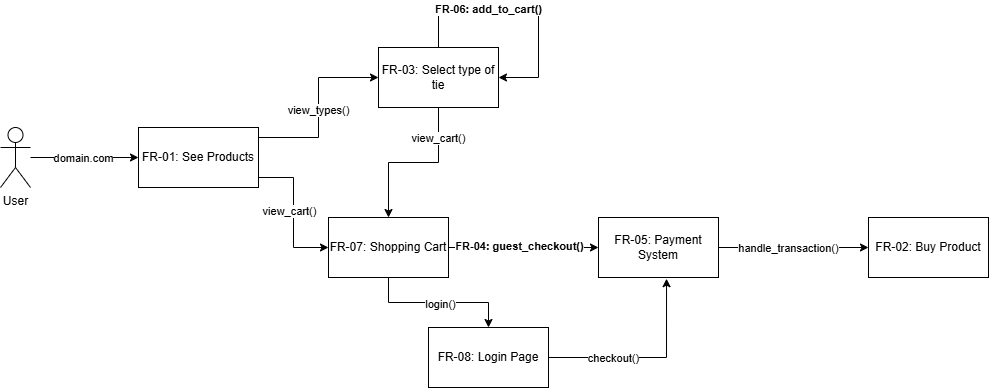

<!-- Fashion website,
5 functional
5 non functional
1 vision -->

# Tied and True

- **Vison:** For businessmen and professionals who are constantly on the move with meetings and events, making a good first impression is crucial. Tied and True introduces soft, silk ties that bring a sleek look to the workplace with a touch of individuality with customizable ties. Our product is easy to wash and still looks new after rough days at work.

***Functional:***

- See products
    - The website should display products with images, descriptions, and prices.
- Buy products
    - The website should allow users to purchase items through a secure checout process.
- Selection of what type of ties
    - Users should be able to filter or browse ties based on type, color, or style.
- Guest checkout
    - Users should have the option to make purchases without creating an account.
- Payment system
    - Payments should be processed using credit/debit cards, PayPal, etc.
- Add to cart then continue shopping
    - The website should allow users to add items to a cart and continue browsing before checking out.

***Non-Functional:***

- Performance
    - The homepage, product listings, and cart should load in less than two seconds.
- Accessibility
    - The website should be screen-reader friendly and conform to WCAG standards.
- Modible Friendly UI/UX
    - The website should be able to conform to mobile devices seamlessly.
- Scalability
    - The website should be able to handle 100+ users without lagging.

## Use case:

| Name: | Purchasing a tie |
| ----------- | ----------- |
| ID | S1 |
| Primary actor | Customer |
| Preconditions | Customer is on the website |
| Postconditions | Customer completes their purchase |
|Main| 1. system displays list of ties customer choose ties   2. customer choose colors   3. customer pay   4. system take to pay method   5. fill in billing address   6. system display corfirm messege   7. send email confirm  

